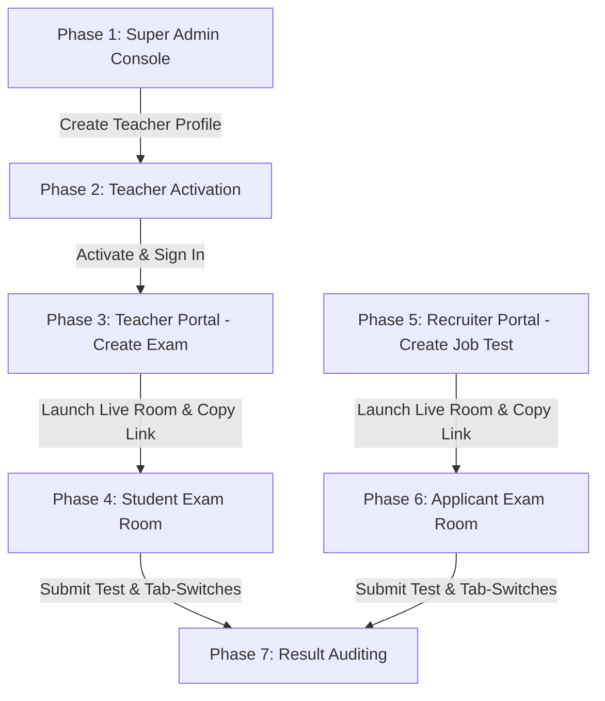

# Achariya Online Exam Portal - Step-by-Step Testing Guide

Welcome to the testing guide for the ACHARIYA Online Examination and Assessment System. This guide is written in plain, simple terms to help you test the entire application end-to-end.

The system contains three administrative portals (Super Admin, Teacher, and Recruiter) and two candidate exam rooms (Student Room and Job Applicant Room). 

The application is deployed at: https://achariya-online-exam.vercel.app/

---

## Default Master Credentials

These credentials are automatically seeded in the database:

| Portal Role | Gateway Link | Username / Email | Password |
| :--- | :--- | :--- | :--- |
| Super Admin | https://achariya-online-exam.vercel.app/admin/login | admin@achariya.org | 123 |
| Recruiter | https://achariya-online-exam.vercel.app/recruitment/login | recruitement@achariya.org  (Note: Check spelling with an extra 'e' between 't' and 'm') | 123 |

---

## Comprehensive Testing Checklist

To test the entire application, follow these phases in order.

---

### Phase 1: Super Admin Console
Goal: Verify system metrics, designation settings, and register a new teacher for testing.

1. Sign In:
   * Open your browser and navigate to the Super Admin Gateway: https://achariya-online-exam.vercel.app/admin/login
   * Sign in with:
     * Email: admin@achariya.org
     * Password: 123
   * Click "Access Control Panel".
2. Explore Dashboard:
   * Go to the Admin Dashboard: https://achariya-online-exam.vercel.app/admin/dashboard
   * Verify that the stats cards (Total Assessments, Active Rooms, Turnout Metrics) load properly.
3. Register a New Teacher:
   * Find the Staff Registry or Teachers section on the dashboard.
   * Click "Add Teacher" (individual setup).
   * Fill out the form fields:
     * Employee ID (User ID): TCH101 (or any unique code)
     * Full Name: Jane Doe
     * Email: janedoe@achariya.org
     * Designation: Senior Lecturer
     * Branch: Villianur Main Campus
     * Subjects: Choose/add one or more subjects (e.g., Mathematics).
     * Qualifications / Experience: Add mock data.
   * Click "Submit" / "Create Teacher".
   * Verify that Jane Doe appears in the active teacher registry list.
4. Sign Out:
   * Click the "Logout" button.

---

### Phase 2: Teacher Portal Activation & Login
Goal: Claim the teacher profile created in Phase 1, set up a password, and log in.

1. Claim & Activate Account:
   * Go to the Teacher Activation Gateway: https://achariya-online-exam.vercel.app/teacher/activate
   * Under Step 1: Identify Profile, enter the registered Email: janedoe@achariya.org (or Employee ID: TCH101).
   * Click "Request Verification OTP".
2. Authenticate with Simulated OTP (Development Bypass):
   * Since this is a test environment, you do not need real email delivery. A yellow "Development Simulation Mode" warning banner will pop up on the screen.
   * Note down the 6-digit Simulated Activation Key displayed in the yellow box (e.g., 123456).
   * Enter these 6 digits into the verification boxes.
   * Click "Verify Code" to proceed to Step 3.
3. Establish Credentials:
   * Set your new password (e.g., janedoe123) in the "Enter New Password" and "Confirm New Password" fields.
   * Click "Complete Activation".
   * Click "Go to Educator Dashboard" once the success screen appears.
4. Subsequent Logins:
   * For any future testing, you can bypass activation and go straight to the Teacher Login page: https://achariya-online-exam.vercel.app/teacher/login using janedoe@achariya.org and janedoe123.

---

### Phase 3: Teacher Portal - Exam & Room Management
Goal: Create a testing assessment (using AI or manual creation) and host a live test room.

1. Create an Assessment:
   * In the Teacher Dashboard (https://achariya-online-exam.vercel.app/teacher/dashboard), go to Assessments -> Create Assessment (or go directly to the assessment creation page: https://achariya-online-exam.vercel.app/teacher/assessments or the generator tool: https://achariya-online-exam.vercel.app/teacher/generate).
   * You have two options:
     * AI Question Bank Generator: Upload a mock text/document file (.pdf, .docx, .txt) or type a text prompt (e.g., "Quadratic Equations for Grade 10"). Set the syllabus board, difficulty, standard vs. HOTS (Higher Order Thinking Skills) mode, and click "Generate". Google Gemini will automatically write custom Multiple Choice Questions (MCQs), short answers, and True/False questions.
     * Manual Draft: Click "Add Question" manually to build your exam.
   * Rearrange questions if needed, change titles, or modify content.
   * Toggle the settings to make the exam Public or Private.
   * Optional: Click "Export to PDF" to check the print/download layout.
   * Click "Save Assessment".
2. Launch a Live Proctor Room:
   * Go to your saved assessments list and locate your new assessment.
   * Click "Launch Live Session".
   * An exam room is created with a unique Session Token.
   * Copy the Live Student URL (which will be in the format: https://achariya-online-exam.vercel.app/live/[session-token]).
   * Keep this Teacher Console tab open. You will monitor the student from here in real-time.

---

### Phase 4: Student Exam Room (Proctor Room)
Goal: Take the exam as a student and test the proctoring anti-cheat sensors.

1. Access the Exam Room:
   * Open a new Incognito/Private window (this allows you to act as a student without logging out of your teacher session).
   * Paste the Live Student URL you copied in Phase 3 (https://achariya-online-exam.vercel.app/live/[session-token]).
2. Register as a Student:
   * Enter mock student details:
     * Name: Billy Candidate
     * Student ID: STU999
     * Grade: 10
     * Section: A
   * Click "Start Assessment".
3. Perform the Exam & Test Anti-Cheat Proctoring:
   * The proctor room will prompt for Fullscreen Mode. Accept it.
   * Begin answering the questions.
   * Test Tab-Switch Intercept:
     * Press Alt + Tab or click outside the browser window (or minimize it).
     * An warning alert will display telling you that focus was lost.
     * Go back to the Teacher Console window (Phase 3) - you will see a real-time red warning notification next to Billy Candidate showing Tab Switch Count: 1.
   * Test the dynamic timer: let the timer run down or click "Submit Assessment" at the bottom of the exam screen when finished.

---

### Phase 5: Recruiter Console
Goal: Create a hiring screening test and launch a proctored recruitment session.

1. Sign In:
   * Navigate to the Recruiter Gateway: https://achariya-online-exam.vercel.app/recruitment/login
   * Sign in with:
     * Email: recruitement@achariya.org
     * Password: 123
   * Click "Enter Recruiter Terminal".
2. Create a Recruitment Exam:
   * Go to the Recruiter Dashboard: https://achariya-online-exam.vercel.app/recruitment/dashboard and select Assessments -> Create Assessment (or go directly to the assessment creation page: https://achariya-online-exam.vercel.app/recruitment/assessments or the generator tool: https://achariya-online-exam.vercel.app/recruitment/generate).
   * Specify:
     * Job Position: (e.g., "Senior Physics Teacher")
     * Department: (e.g., "Teaching")
     * Recruitment For: (e.g., "Achariya Arts and Science College")
     * Test Duration: (e.g., 20 minutes)
   * Write or generate the assessment questions, and click "Save".
3. Launch Recruitment Proctor Session:
   * Locate the created test and click "Launch Live Session".
   * Copy the Recruitment Live Link (which will be in the format: https://achariya-online-exam.vercel.app/live/recruitment/[session-token]).
   * Keep this Supervisor screen open to monitor applicants in real-time.

---

### Phase 6: Candidate Exam Room (Recruitment)
Goal: Test the job applicant assessment portal and strict disqualification flags.

1. Access the Exam Room:
   * Open a new Incognito/Private window.
   * Paste the Recruitment Live Link copied in Phase 5 (https://achariya-online-exam.vercel.app/live/recruitment/[session-token]).
2. Register as an Applicant:
   * Enter candidate details:
     * Name: Dr. Sarah Tester
     * Email: sarah@testemail.com
     * Phone: 9876543210
     * Qualification: Ph.D. in Physics
     * Experience: 5 Years
   * Click "Start Screening Test".
3. Submit the Test & Validate Anti-Cheat Logs:
   * Complete the test questions.
   * Test tab-switching. If the Recruiter enabled the strict Auto-Disqualification rule, switching tabs may immediately terminate your test session and lock you out.
   * Click "Submit Screening" when finished.

---

### Phase 7: Result Auditing
Goal: Verify that completed test logs are correctly synced and stored.

1. Teacher Portal Check:
   * Go back to the Teacher Dashboard: https://achariya-online-exam.vercel.app/teacher/dashboard
   * Inspect the completed session records for the assessment you created.
   * Verify that Billy Candidate's final score, time taken, and total tab-switch violations are logged.
2. Recruiter Portal Check:
   * Go back to the Recruiter Dashboard: https://achariya-online-exam.vercel.app/recruitment/dashboard
   * Inspect the candidate database under the Candidates registry (https://achariya-online-exam.vercel.app/recruitment/candidates).
   * Verify that Dr. Sarah Tester's profile, resume details (experience/qualification), assessment score, and proctor violations are accurately logged.
3. Super Admin Check:
   * Log back into the Super Admin Console: https://achariya-online-exam.vercel.app/admin/login
   * Go to the Super Admin Dashboard: https://achariya-online-exam.vercel.app/admin/dashboard
   * Verify that global platform metrics (e.g., Total Assessments Created) have increased to reflect the new tests.
